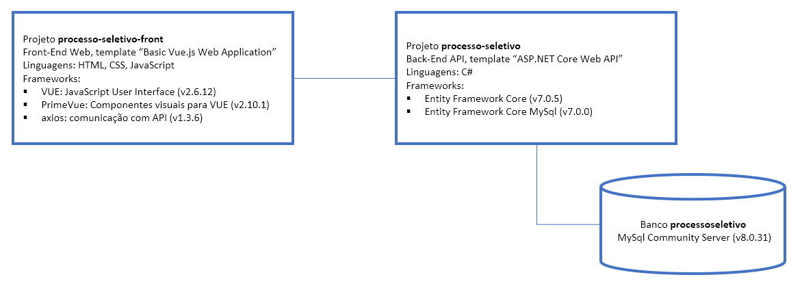

# processo-seletivo
Aplicação de avaliação ténica para o cargo de desenvolvedor C# na Hepta.

O teste foi feito com uma arquitetura simplificada para facilitar o entendimento. Em alguns pontos não foram seguidas as melhores práticas para deixar o código mais compacto e simples. A aplicação é um front-end Web para visualização e gerenciamento (CRUD) em uma listagem de funcionários armazenada em banco de dados:

A aplicação já tem implementada a funcionalidade de **exibição** dos registros. O teste consiste na implementação das funcionalidades de **inclusão**, **edição** e **exclusão** de registros do banco, **CONTINUANDO** o projeto existente.

## Pré-requisitos de software

1. **Vue 2** framework JavaScript para UI
1. **Visual Studio 2022 Community** para edição dos projetos.
2. **MySql Community** - banco testado com a versão 8.0.31
3. (Opcional) **DBeaver** para visualização da tabela no banco de dados.

## Subindo o ambiente de desenvolvimento

1. Instalar o MySql.
2. Fazer o restore do banco de dados "**processoseletivo**" no MySql a partir do seu arquivo de dump ([dump-processoseletivo.sql](dump-processoseletivo.sql)).
   
3. Instalar o Visual Studio:

   a. Cargas de trabalho ("workloads") "ASP.NET and web development" e "Node.js development"
   
2. Instalar o Vue (*instruções para máquina Windows, para outros SO's siga a documentação do produto*):

   a. instalar nvm, para instalação do npm e node.js (prereqs para Vue): [https://github.com/coreybutler/nvm-windows/releases](https://github.com/coreybutler/nvm-windows/releases)
   
   b. instalar npm e node.js (deve ser usada a versão 16.16.0 no node): 
      - command prompt
      - `nvm install 16.16.0`
      - `nvm use 16.16.0` 
      
   c. instalar Vue 2: 
      - command prompt
      - `npm install -g vue@^2`
      - `npm install -g @vue/cli`
      - `npm install -g @vue/cli-service`
  
4. Preparar o projeto para execução:

   a. Clonar este repositório no Visual Studio
      - Local do repositório: **https://github.com/gbhepta/processo-seletivo**
   
   b. Instalar npm packages no projeto front-end: 
      - Gerenciador de Soluções > processo-seletivo-front > npm > botão direito >  "Instalar os Pacotes de npm"
      - Esperar final da instalação na janela de Saída, "mostrar saída de:" > Npm
   
   c. Alterar a credencial usada para acesso ao banco no MySql. A string de conexão está no local padrão de geração do Entity Framework (arquivo de contexto na pasta Models do projeto da API).
   
   d. Reiniciar o Visual Studio.

## Testando o ambiente de desenvolvimento

1. Executar ("Start Without Debugging") o projeto da API. Usar a interface Swagger para executar os endpoints `/api/Status/servidorweb` e `/api/Status/bancodados`. O retorno de ambos deve ser HTTP 200 ("API operacional" e "BD operacional"). Algumas sugestões em caso de erro: 
   - credenciais de acesso ao MySql estão corretas?
   - nome do banco de dados está correto? ("*processoseletivo*")
   - o restore foi feito no banco correto?
   - se o MySql está remoto (não está em localhost) o usuário sendo usado para acesso ao banco deve ser configurado para acesso remoto.
1. Executar ("Start Without Debugging") o projeto do front-end. A tela inicial "Funcionários" deve ser mostrada, listando os registros cadastrados em banco.

## O que fazer agora

Continue o desenvolvimento do projeto, implementando as seguintes funcionalidades:

### Inclusão de registros: 
- A parte do front-end já está implementada, exceto a chamada para o endpoint de inclusão de novo registro na API.
- A parte do back-end (endpoint de inclusão de novo registro) também já está implementada. 
- Você deve realizar a chamada ao endpoint a partir do front-end para que o registro seja incluído.

### Alteração e exclusão de registros:
- A parte do front-end tem apenas a ativação da funcionalidade implementada (botões de "Alterar" e "Excluir" no grid de visualização de funcionários).
- No caso da exclusão, você deve implementar:
   - o endpoint de exclusão de registro;
   - a chamada ao endpoint para a exclusão do registro.
- No caso da alteração você deve implementar:
   - o endpoint de alteração de registro; 
   - a Dialog com o formulário para o usuário fornecer os novos valores (pode ser tomada como exemplo a Dialog de inclusão de novo registro);
   - a chamada ao endpoint para a alteração do registro. 
   
## Como entregar seu trabalho

Envie o link do projeto no seu repositório (GitHub ou GitLab) para gilberto@hepta.com.br com o título "Processo Seletivo - [seu nome]". Lembre-se de adicionar um arquivo HOWTO.md descrevendo o necessário para execução da aplicação e dos testes.

O objetivo desse teste é medir o seu conhecimento sobre as boas práticas de programação, facilidade em aprender novas tecnologias e de melhorar/continuar projetos em andamento.

Você tem o prazo de 1 semana, a partir do dia posterior ao de envio. Mesmo que não complete todo o teste, envie mesmo assim, ele não é de caráter desclassificatório, mas sim, classificatório. Sinta-se a vontade para implementar mais funcionalidades e alterações de interface - dado o caráter classificatório do teste, quanto mais, melhor. Algumas sugestões de evoluções da aplicação:
- Substituir o uso da função "alert()" nas notificações ao usuário por um componente PrimeVue adequado (p.e. Toast)
- Incorporar a propriedade "lotação" nas operações de inclusão e alteração de registro  (*** destaque ***)
- Implementação de loaders nas chamadas à API

